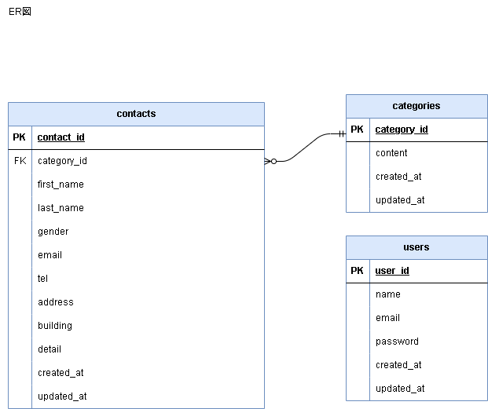

# お問い合わせフォーム：confirmation-test1

## 環境構築

**Dockerビルド**
<!-- 自身で作成時、2.の箇所がなかった -->
1. git clone git@github.com:ai2525desu/confirmation-test1.git
2. Docker Desktopを立ち上げる
3. docker compose up -d --build

<!-- Laravelの環境構築で下記の１～５がぬけていた -->
**Laravel環境構築**
1. docker compose exec php bash
2. composer install
3. 「.env example」ファイルを「.env」ファイルに命名変更。または、新しく.envファイルを作成
4. .envファイルにいあkの環境変数を追加
`DB_CONNECTION=mysql`
`DB_HOST=mysql`
`DB_PORT=3306`
`DB_DATABASE=laravel_db`
`DB_USERNAME=laravel_user`
`DB_PASSWORD=laravel_pass`
5. アプリケーションキーの作成
`php artisan key:generate`
6. マイグレーションの実行
`php artisan migrate`
7. シーディングの実行
`php artisan db:seed`

<!-- 下記は自身で作成 -->
**マイグレーション**
* php artisan migrate
* 自身で作成
    1. 2025_05_28_022233_create_categories_table.php
    2. 2025_05_28_022635_create_contacts_table.php

**シーディング**
* php artisan db:seed
* 上記コマンドでエラーが発生した場合、下記の順でシーディング
    1. CategoiesTableSeederからシーディング
        - php artisan db:seed --class=CategoiesTableSeeder
    2. ContactsTableSeederのジーディング
        - php artisan db:seed --class=ContactsTableSeeder

<!-- これはおおむね解答と同じ。解答では、php,Laravel,mysqlのみだった -->
## 使用技術(実行環境)
- Docker version 28.1.1, build 4eba377
- Laravel Framework 8.83.29
- PHP 7.4.9 (cli) (built: Sep  1 2020 02:33:08)
- nginx:1.21.1
- mysql:8.0.26

<!-- ER図内容OK -->
## ER図

<!-- 解答では、開発環境とphpMyadminだけだったが、自身のもののほうが分割されていて見やすいと感じるがどうか -->
## URL
* お問い合わせ入力フォーム：http://localhost/
* ユーザー登録画面：http://localhost/register
* ログイン画面：http://localhost/login
* phpMyadmin：http://localhost:8080/

